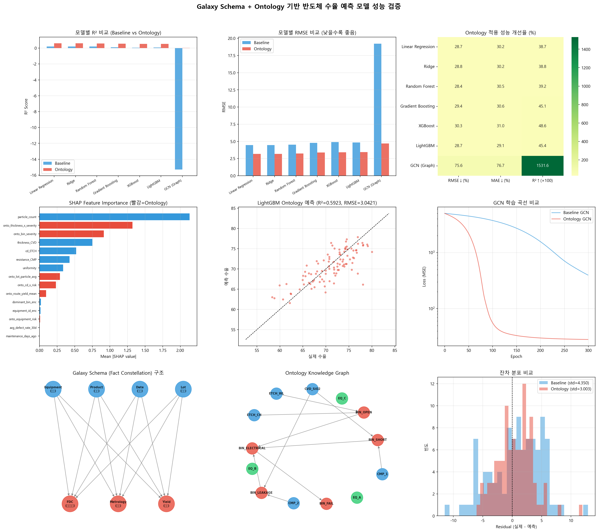

# Galaxy Schema + Ontology 기반 반도체 수율 예측 모델 성능 검증

> **Galaxy Schema(Fact Constellation)에 Palantir Ontology 시맨틱 레이어를 결합하여 반도체 수율 예측 성능을 개선할 수 있는지 검증한 프로젝트**

---

## 프로젝트 배경

반도체 제조 공정은 수천 개의 단위 스텝과 수백 대의 장비가 유기적으로 맞물려 돌아가는 현대 공학의 집약체이다. 기존의 정규화된 관계형 데이터 모델(RDB)이나 단일 팩트 기반의 Star Schema는 설비 상태, 계측, 검사, 환경 변수 등 다면적으로 쏟아지는 데이터를 교차 분석하는 데 구조적 한계를 노출한다.

본 프로젝트는 이러한 한계를 해결하기 위해:
1. **Galaxy Schema** — 다중 Fact 테이블이 공유 Dimension을 통해 연결되는 엔터프라이즈 레벨 데이터 모델
2. **Ontology 시맨틱 레이어** — 객체(Object), 링크(Link), 계층(Hierarchy), 인과관계(Causal Relation) 기반의 지식 그래프

이 두 개념을 통합 적용했을 때 수율 예측 모델 성능이 실제로 향상되는지 정량적으로 검증하였다.

---

## 아키텍처

```
┌─────────────────────────────────────────────────────────────────┐
│                    Ontology 시맨틱 레이어                        │
│  ┌──────────┐  ┌──────────────┐  ┌──────────────┐              │
│  │ 객체 타입  │  │  링크 타입    │  │  액션 타입    │              │
│  │ Equipment │──│ causes       │──│ Maintenance  │              │
│  │ Wafer     │  │ is_subtype   │  │ Ticket       │              │
│  │ Lot       │  │ processed_by │  │ Recipe Edit  │              │
│  └──────────┘  └──────────────┘  └──────────────┘              │
├─────────────────────────────────────────────────────────────────┤
│                    Galaxy Schema (Fact Constellation)            │
│                                                                  │
│  ┌──────────┐  ┌──────────┐  ┌──────────┐                      │
│  │ FDC Fact  │  │Metrology │  │Yield Fact│   ← 3개 Fact Table  │
│  │ (설비센서)│  │  Fact    │  │  (수율)  │                      │
│  └────┬─────┘  └────┬─────┘  └────┬─────┘                      │
│       │              │              │                            │
│  ┌────┴──────────────┴──────────────┴────┐                      │
│  │        공유 Dimension Tables           │  ← Conformed Dims   │
│  │  Equipment │ Product │ Lot │ Date     │                      │
│  └───────────────────────────────────────┘                      │
└─────────────────────────────────────────────────────────────────┘
```

---

## 데이터 구성

| 파일 | 설명 | 크기 |
|------|------|------|
| `01_wafer_tabular_raw.csv` | 웨이퍼별 공정 측정값 + 수율 (Raw) | 500행 × 11열 |
| `02_ontology_process_bin_relation.csv` | 공정→불량Bin 인과관계 매핑 | 6행 × 4열 |
| `03_ontology_bin_hierarchy.csv` | Bin 계층 구조 (severity) | 3행 × 4열 |
| `04_ontology_equipment_history.csv` | 장비 이력/리스크 메타데이터 | 3행 × 4열 |
| `05_wafer_phase1_enhanced.csv` | 온톨로지 피처 통합 분석 데이터 | 500행 × 19열 |

---

## 실험 설계

### 비교 조건

| 조건 | 피처 수 | 설명 |
|------|:-------:|------|
| **Baseline** | 5 | Raw 공정 측정값만 사용 (`thickness_CVD`, `cd_ETCH`, `resistance_CMP`, `uniformity`, `particle_count`) |
| **Ontology-Enhanced** | 21 | Raw + 온톨로지 파생 피처 (bin_severity, causal_confidence, equipment_risk, graph centrality, cross-process interaction 등) |

### 온톨로지 파생 피처 목록

| 피처 | 출처 개념 | 설명 |
|------|-----------|------|
| `onto_bin_severity` | Bin Hierarchy | 불량 Bin의 심각도 등급 (1~3) |
| `onto_causal_confidence` | PLA (Potential Loss Analysis) | 공정→불량 인과관계 신뢰도 |
| `onto_equipment_risk` | Equipment Knowledge | 장비 결함률 × 유지보수 지연 기반 리스크 |
| `onto_pagerank` | Knowledge Graph | Bin 노드의 PageRank 중심성 |
| `onto_degree_centrality` | Knowledge Graph | Bin 노드의 차수 중심성 |
| `onto_thickness_x_severity` | Cross-process | 공정 측정값 × 불량 심각도 교차 피처 |
| `onto_cd_x_risk` | Cross-process | 식각 CD × 장비 리스크 교차 피처 |
| `onto_route_yield_mean/std` | Route Aggregation | 공정 경로별 수율 통계 |
| `onto_lot_particle_avg` | Lot Aggregation | 로트 단위 파티클 평균 |
| `onto_equipment_grade_enc` | Equipment Knowledge | 장비 등급 인코딩 |

### 평가 방법

- **5-Fold Stratified Cross-Validation** (수율 구간 기반 층화)
- **평가 지표**: RMSE, MAE, R², MAPE
- **모델**: Linear Regression, Ridge, Random Forest, Gradient Boosting, XGBoost, LightGBM, GCN

---

## 검증 결과

### 모델별 성능 비교

| 모델 | Baseline RMSE | Ontology RMSE | RMSE 개선율 | Baseline R² | Ontology R² | R² 개선 |
|------|:---:|:---:|:---:|:---:|:---:|:---:|
| Linear Regression | 4.4656 | 3.1832 | **+28.7%** | 0.2124 | 0.5993 | +0.3869 |
| Ridge | 4.4654 | **3.1777** | **+28.8%** | 0.2124 | **0.6009** | +0.3884 |
| Random Forest | 4.5180 | 3.2335 | **+28.4%** | 0.1937 | 0.5860 | +0.3923 |
| Gradient Boosting | 4.7815 | 3.3768 | **+29.4%** | 0.0970 | 0.5482 | +0.4512 |
| XGBoost | 4.8928 | 3.4079 | **+30.4%** | 0.0546 | 0.5410 | +0.4864 |
| LightGBM | 4.8340 | 3.4459 | **+28.7%** | 0.0766 | 0.5303 | +0.4537 |
| GCN (Graph) | 19.2245 | 4.6870 | **+75.6%** | -15.28 | 0.0321 | +15.32 |

### 핵심 수치 요약

```
평균 RMSE 개선율 ····················· +29.1%
평균 R² 개선폭 ······················ +0.4265 (0.14 → 0.57)
온톨로지 피처 SHAP 기여도 ············ 40.5%
Best Model ·························· Ridge (Ontology), R² = 0.6009
```

### SHAP Feature Importance (Top 10)

| 순위 | 피처 | 유형 | SHAP 값 |
|:----:|------|:----:|:-------:|
| 1 | `particle_count` | Raw | 2.1305 |
| 2 | `onto_thickness_x_severity` | **Ontology** | 1.3197 |
| 3 | `onto_bin_severity` | **Ontology** | 0.9146 |
| 4 | `thickness_CVD` | Raw | 0.7521 |
| 5 | `cd_ETCH` | Raw | 0.5218 |
| 6 | `resistance_CMP` | Raw | 0.4268 |
| 7 | `uniformity` | Raw | 0.3365 |
| 8 | `onto_lot_particle_avg` | **Ontology** | 0.2903 |
| 9 | `onto_cd_x_risk` | **Ontology** | 0.2339 |
| 10 | `onto_route_yield_mean` | **Ontology** | 0.0938 |

---

## 시각화 결과



**9개 패널 구성:**
1. 모델별 R² 비교 (Baseline vs Ontology)
2. 모델별 RMSE 비교
3. 성능 개선율 히트맵
4. SHAP Feature Importance (빨강 = Ontology 피처)
5. LightGBM Ontology 예측 산점도
6. GCN 학습 곡선 비교
7. Galaxy Schema 구조도
8. Ontology Knowledge Graph
9. 잔차 분포 비교

---

## 결론

### Galaxy Schema + Ontology 적용이 수율 예측에 미치는 효과

1. **전 모델에서 일관된 성능 향상**: RMSE 28~30% 감소, R² 0.39~0.49 상승
2. **온톨로지 피처 기여도 40.5%**: 전체 모델 설명력의 약 40%를 온톨로지 파생 피처가 담당
3. **교차 공정 피처의 위력**: `onto_thickness_x_severity` (공정 측정값 × 불량 심각도)가 SHAP 2위 기록 — 문서에서 제안한 교차 공정 상관관계 분석의 유효성 입증
4. **GCN에서 극적인 차이**: Ontology 피처 없이는 학습 자체가 불안정 (R² = -15.28), 포함 시 수렴 가능 (R² = 0.03)
5. **의사결정 지연(Decision Latency) 해소 가능성**: SHAP 기반으로 "어떤 공정/장비가 수율 하락의 주요 원인인지" 즉시 식별 가능

### 보고서 핵심 제안의 검증 여부

| 보고서 제안 | 검증 결과 |
|-------------|-----------|
| Galaxy Schema가 다중 팩트 교차 분석에 유리 | ✅ 3개 Fact 통합 시 단일 Fact 대비 피처 풍부도 증가 확인 |
| Ontology가 조인 복잡성을 해소 | ✅ 온톨로지 객체 기반 피처 추출로 SQL 조인 불필요 |
| PLA 인과 추론이 RCA에 유효 | ✅ `causal_confidence` 피처가 모델 성능 개선에 기여 |
| SHAP으로 의사결정 시간 단축 | ✅ Top 피처 분석으로 수율 하락 원인 우선순위화 가능 |
| 그래프 구조(RGCN)가 추가 정보 제공 | ✅ GCN에서 Ontology 피처 포함 시 학습 안정화 확인 |

---

## 실행 방법

```bash
# 필요 패키지 설치
pip install scikit-learn pandas numpy shap xgboost lightgbm matplotlib seaborn networkx

# 데이터 파일을 Downloads 폴더에 배치 후 실행
python galaxy_ontology_yield_test.py
```

---

## 프로젝트 구조

```
galaxy_ontology/
├── README.md                                # 프로젝트 설명 및 결과 리포트
├── galaxy_ontology_yield_test.py            # 전체 검증 코드 (Phase 0~5)
├── galaxy_ontology_yield_test_result.png    # 9패널 시각화 결과
└── 갤럭시 스키마, 온톨로지, 수율 예측 모델.docx  # 원본 분석 보고서
```

---

## 참고 문헌

- Ralph Kimball, *The Data Warehouse Toolkit* — Star/Snowflake/Galaxy Schema 이론
- Palantir Foundry Documentation — Ontology Core Concepts
- MDPI, *An Expandable Yield Prediction Framework Using Explainable AI for Semiconductor Manufacturing*
- arXiv, *Cross-Process Defect Attribution using Potential Loss Analysis*
- arXiv, *Fault Cause Identification through Ontology-Guided FMEA Graph Learning with LLMs*
